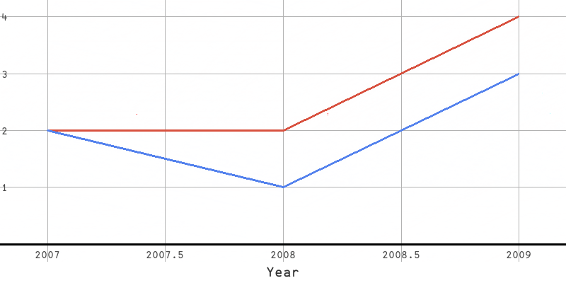
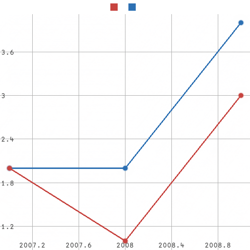

# uiua-plot

`uiua-plot` is a data plotting library for the [Uiua](https://uiua.org) programming language.

The library requires `# Experimental!` due to reliance on the `layout` function for text rendering, reliance on [`uiua-math`](https://github.com/Omnikar/uiua-math), and internal usage of experimental modifiers/functions.

To create a plot, you first need to make a `PlotConfig`. This can be done in two main ways.

If you just want to get straight to plotting data, you can just create a new `PlotConfig`, which is initialized with some default values.
```uiua
# Experimental!
~ "git: github.com/Omnikar/uiua-plot" ~ PlotConfig
PlotConfig
```
On the other hand, if you want to configure how your plot is drawn, you can use a builder pattern as follows, using `°⊸` to set fields.
```uiua
# Experimental!
~ "git: github.com/Omnikar/uiua-plot" ~ PlotConfig
PlotConfig!(
  New
  # Minimum and maximum x bounds
  °⊸XBounds 2006.9_2009.1
  # Minimum and maximum y bounds
  °⊸YBounds ¯0.3_4.3
  # Spacing between gridlines in the x and y directions
  °⊸GridlineInterval 0.5_1
  # Size of the image to produce
  °⊸Size 800_400
  # Color(s) to use for plotting the data
  °⊸PlotColor [0.33_0.51_0.93 0.85_0.32_0.25]
  # Labels for the data series
  °⊸PlotLabel {"Ice Cream Sales" "Shark Attacks"}
  # Whether to draw dots or not
  °⊸DrawDots 0
  # Label of the x-axis
  °⊸XLabel "Year"
)
```

Once you have a `PlotConfig`, you can use it to plot some data with the `Plot` function. This function can take a single `N×2` array to plot one data series of N entries, or it can take a box list of such arrays to plot multiple data series.
```uiua
# Experimental!
~ "git: github.com/Omnikar/uiua-plot" ~ Plot PlotConfig
PlotConfig!(
  New
  # Minimum and maximum x bounds
  °⊸XBounds 2006.9_2009.1
  # Minimum and maximum y bounds
  °⊸YBounds ¯0.3_4.3
  # Spacing between gridlines in the x and y directions
  °⊸GridlineInterval 0.5_1
  # Size of the image to produce
  °⊸Size 800_400
  # Color(s) to use for plotting the data
  °⊸PlotColor [0.33_0.51_0.93 0.85_0.32_0.25]
  # Labels for the data series
  °⊸PlotLabel {"Ice Cream Sales" "Shark Attacks"}
  # Whether to draw dots or not
  °⊸DrawDots 0
  # Label of the x-axis
  °⊸XLabel "Year"
)

&ims Plot {
  [2007_2 2008_1 2009_3]
  [2007_2 2008_2 2009_4]}
```
This code produces the following output ([try it online](https://uiua.org/pad?src=0_13_0-dev_3__IyBFeHBlcmltZW50YWwhCn4gImdpdDogZ2l0aHViLmNvbS9PbW5pa2FyL3VpdWEtcGxvdCIgfiBQbG90IFBsb3RDb25maWcKUGxvdENvbmZpZyEoCiAgTmV3CiAgIyBNaW5pbXVtIGFuZCBtYXhpbXVtIHggYm91bmRzCiAgwrDiirhYQm91bmRzIDIwMDYuOV8yMDA5LjEKICAjIE1pbmltdW0gYW5kIG1heGltdW0geSBib3VuZHMKICDCsOKKuFlCb3VuZHMgwq8wLjNfNC4zCiAgIyBTcGFjaW5nIGJldHdlZW4gZ3JpZGxpbmVzIGluIHRoZSB4IGFuZCB5IGRpcmVjdGlvbnMKICDCsOKKuEdyaWRsaW5lSW50ZXJ2YWwgMC41XzEKICAjIFNpemUgb2YgdGhlIGltYWdlIHRvIHByb2R1Y2UKICDCsOKKuFNpemUgODAwXzQwMAogICMgQ29sb3IocykgdG8gdXNlIGZvciBwbG90dGluZyB0aGUgZGF0YQogIMKw4oq4UGxvdENvbG9yIFswLjMzXzAuNTFfMC45MyAwLjg1XzAuMzJfMC4yNV0KICAjIExhYmVscyBmb3IgdGhlIGRhdGEgc2VyaWVzCiAgwrDiirhQbG90TGFiZWwgeyJJY2UgQ3JlYW0gU2FsZXMiICJTaGFyayBBdHRhY2tzIn0KICAjIFdoZXRoZXIgdG8gZHJhdyBkb3RzIG9yIG5vdAogIMKw4oq4RHJhd0RvdHMgMAogICMgTGFiZWwgb2YgdGhlIHgtYXhpcwogIMKw4oq4WExhYmVsICJZZWFyIgopCgomaW1zIFBsb3QgewogIFsyMDA3XzIgMjAwOF8xIDIwMDlfM10KICBbMjAwN18yIDIwMDhfMiAyMDA5XzRdfQo=)):


If unspecified, plot bounds and gridline spacing are inferred, and some default settings are used.
```uiua
# Experimental!
~ "git: github.com/Omnikar/uiua-plot" ~ Plot PlotConfig
# Create a default `PlotConfig` with zero configuration
PlotConfig
&ims Plot {
  [2007_2 2008_1 2009_3]
  [2007_2 2008_2 2009_4]}
```


Fields supporting inference actually have their values default to `[∞ ∞]`, and these are replaced with inferred values when `Plot` is called. If you want, you can take advantage of this to partially infer some fields, for example by setting `Max` to `[10 ∞]` to use an upper bound of `10` in the x direction, but infer the upper bound in the y direction.

In addition to `Plot` for creating scatter/line plots, `BarChart` and `Histogram` are also available. See the in-code documentation for more information on how to use these. <sub>TODO: Document these more.</sub>

All available configuration values for `PlotConfig` are in the following table. Any field marked with "Distributive" will distribute its values across multiple data series, repeating values or defaults if necessary.
| Field | Shape | Description | Default |
|---|---|---|---|
| `XBounds` | `[2]` | The minimum and maximum x bounds of the plot (overrides `Min` and `Max`) | Inferred |
| `YBounds` | `[2]` | The minimum and maximum y bounds of the plot (overrides `Min` and `Max`) | Inferred |
| `Min` | `[2]` | The minimum x and y bounds of the plot (overrides `XBounds` and `YBounds`) | Inferred |
| `Max` | `[2]` | The maximum x and y bounds of the plot (overrides `XBounds` and `YBounds`) | Inferred |
| `Size` | `[2]` | The pixel dimensions of the image to output | `[512 512]` |
| `BgColor` | `[3]` or `[4]` | Plot background color | `[1 1 1]` |
| `AxisWidth` | `[]` | Thickness of the main axes | `3` |
| `AxisColor` | `[3]` or `[4]` | Color of the main axes | `[0 0 0]` |
| `GridlineWidth` | `[]` | Thickness of the gridlines | `1` |
| `GridlineColor` | `[3]` or `[4]` | Color of the gridlines | `[0.7 0.7 0.7]` |
| `GridlineInterval` | `[2]` | Spacing between gridlines in the x and y directions | Inferred |
| `NumberSize` | `[]` | Font size to use for axis numbers | `15` |
| `NumberColor` | `[3]` or `[4]` | Font color to use for axis numbers | `[0.3 0.3 0.3]` |
| `XLabel` | string | x-axis label | `""` |
| `YLabel` | string | y-axis label | `""` |
| `AxisLabelSize` | `[]` | Font size to use for axis labels | `20` |
| `AxisLabelColor` | `[3]` or `[4]` | Font color to use for axis labels | `[0.2 0.2 0.2]` |
| `PlotColor` | `[3]`, `[4]`, `[x 3]`, or `[x 4]` | (Distributive) Colors with which to plot data series | [Desmos graph colors](https://www.desmos.com/api/v1.7/docs/index.html#document-colors) |
| `PlotLabel` | boxed string list | (Distributive) Labels, for each data series, to put in the legend | `□""` |
| `PlotLabelSize` | `[]` | Font size to use for data series labels | `15` |
| `PlotLabelColor` | `[3]`, `[4]`, `[x 3]`, or `[x 4]` | (Distributive) Font colors to use for data series labels | `[0.2 0.2 0.2]` |
| `DrawDots` | `[]` or `[x]` | (Distributive) Whether to draw dots when plotting a series; expects `0` or `1` | `1` |
| `DotSize` | `[]` or `[x]` | (Distributive) Size with which to draw dots | `40` |
| `DrawLines` | `[]` or `[x]` | (Distributive) Whether to draw lines when plotting a series; expects `0` or `1` | `1` |
| `LineWidth` | `[]` or `[x]` | (Distributive) Thickness with which to draw lines | `8` |
| `BarWidth` | `[]` | Width with which to draw each bar | `40` |
| `BarLabel` | boxed string list | Labels to use for each bar/bar cluster | `□""` |
| `BarLabelSize` | `[]` | Font size to use for bar/bar cluster labels | `15` |
| `BarLabelColor` | `[3]` or `[4]` | Font color to use for bar/bar cluster labels | `[0.2 0.2 0.2]` |
