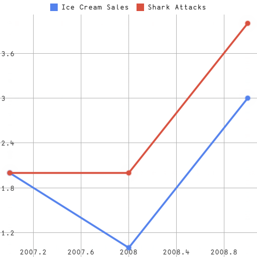
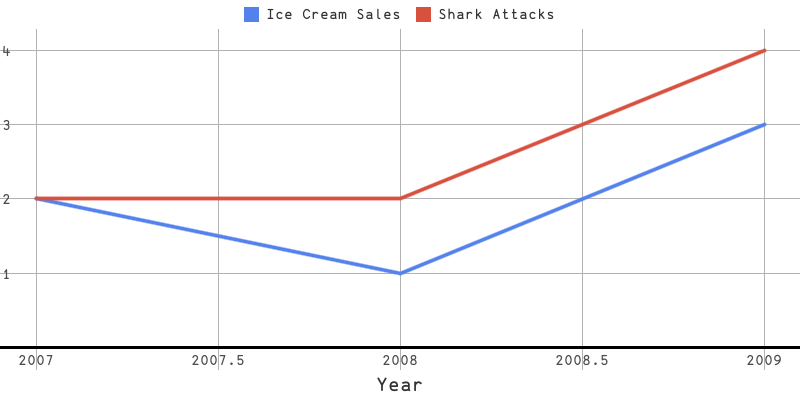
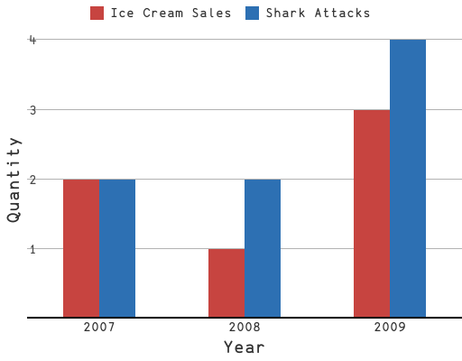
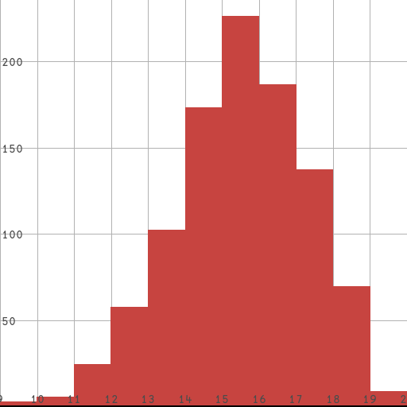
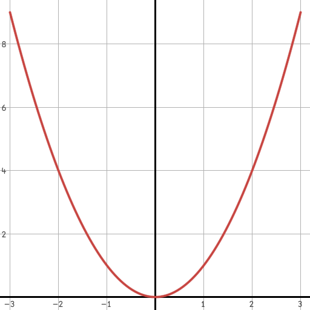

# uiua-plot

`uiua-plot` is a data plotting library for the [Uiua](https://uiua.org) programming language.

The library requires `# Experimental!` due to reliance on the `layout` function for text rendering, reliance on [`uiua-math`](https://github.com/Omnikar/uiua-math), and internal usage of experimental modifiers/functions.

To be able to plot data, you need to turn it into a `Data` instance. `Data` wraps raw data with configuration that affects how it is plotted.

To wrap raw data using default configuration values, just call `Data` directly.
```uiua
# Experimental!
~ "git: github.com/Omnikar/uiua-plot" ~ Data
Data [2007_2 2008_1 2009_3]
```
Or use `≡ rows` if you have multiple series.
```uiua
# Experimental!
~ "git: github.com/Omnikar/uiua-plot" ~ Data
≡Data [
  [2007_2 2008_1 2009_3]
  [2007_2 2008_2 2009_4]]
```

On the other hand, if you want to configure how series are drawn, you can use a builder pattern as follows, using `°⊸` to set fields.
```uiua
# Experimental!
~ "git: github.com/Omnikar/uiua-plot" ~ Data
[Data!(
    New [2007_2 2008_1 2009_3]
    # Color to draw the plot
    °⊸Color 0.33_0.51_0.93
    # Label to use in the plot legend
    °⊸Label "Ice Cream Sales"
  )
 Data!(
    New [2007_2 2008_2 2009_4]
    °⊸Color 0.85_0.32_0.25
    °⊸Label "Shark Attacks"
  )]
```

## Scatter/Line plots

Once you have the `Data` you want to plot (as either a single instance or an array of `Data`), you can use the `Plot` function to plot it.

To plot without additional configuration, simply invoke `Plot` with the data. This will produce an RGBA image.
```uiua
# Experimental!
~ "git: github.com/Omnikar/uiua-plot" ~ Data Plot
[Data!(
    New [2007_2 2008_1 2009_3]
    # Color to draw the plot
    °⊸Color 0.33_0.51_0.93
    # Label to use in the plot legend
    °⊸Label "Ice Cream Sales"
  )
 Data!(
    New [2007_2 2008_2 2009_4]
    °⊸Color 0.85_0.32_0.25
    °⊸Label "Shark Attacks"
  )]
&ims Plot
```
This code produces the following output:  


However, you will often want to configure specific parts of the actual plot. This can be done by creating a `PlotConfig`, again using a builder pattern to set fields. In order to pass a `PlotConfig` to the `Plot` function, use `⬚ fill`.
```uiua
# Experimental!
~ "git: github.com/Omnikar/uiua-plot" ~ Data Plot PlotConfig
[Data!(
    New [2007_2 2008_1 2009_3]
    # Color to draw the plot
    °⊸Color 0.33_0.51_0.93
    # Label to use in the plot legend
    °⊸Label "Ice Cream Sales"
  )
 Data!(
    New [2007_2 2008_2 2009_4]
    °⊸Color 0.85_0.32_0.25
    °⊸Label "Shark Attacks"
  )]
PlotConfig!(
  New
  # Minimum and maximum x bounds
  °⊸XBounds 2006.9_2009.1
  # Minimum and maximum y bounds
  °⊸YBounds ¯0.3_4.3
  # Spacing between gridlines in the x and y directions
  °⊸GridlineInterval 0.5_1
  # Size of the image to produce
  °⊸Size 800_400
  # Whether to draw dots
  # Setting this in `PlotConfig` provides a default for all series.
  # Use the identically-named field in `Data` for individual series.
  °⊸DrawDots 0
  # Label of the x-axis
  °⊸XLabel "Year"
)
&ims ⬚∘Plot
```
This code produces the following output ([try it online](https://uiua.org/pad?src=0_14_0-dev_1__IyBFeHBlcmltZW50YWwhCn4gImdpdDogZ2l0aHViLmNvbS9PbW5pa2FyL3VpdWEtcGxvdCIgfiBEYXRhIFBsb3QgUGxvdENvbmZpZwpbRGF0YSEoCiAgICBOZXcgWzIwMDdfMiAyMDA4XzEgMjAwOV8zXQogICAgIyBDb2xvciB0byBkcmF3IHRoZSBwbG90CiAgICDCsOKKuENvbG9yIDAuMzNfMC41MV8wLjkzCiAgICAjIExhYmVsIHRvIHVzZSBpbiB0aGUgcGxvdCBsZWdlbmQKICAgIMKw4oq4TGFiZWwgIkljZSBDcmVhbSBTYWxlcyIKICApCiBEYXRhISgKICAgIE5ldyBbMjAwN18yIDIwMDhfMiAyMDA5XzRdCiAgICDCsOKKuENvbG9yIDAuODVfMC4zMl8wLjI1CiAgICDCsOKKuExhYmVsICJTaGFyayBBdHRhY2tzIgogICldClBsb3RDb25maWchKAogIE5ldwogICMgTWluaW11bSBhbmQgbWF4aW11bSB4IGJvdW5kcwogIMKw4oq4WEJvdW5kcyAyMDA2LjlfMjAwOS4xCiAgIyBNaW5pbXVtIGFuZCBtYXhpbXVtIHkgYm91bmRzCiAgwrDiirhZQm91bmRzIMKvMC4zXzQuMwogICMgU3BhY2luZyBiZXR3ZWVuIGdyaWRsaW5lcyBpbiB0aGUgeCBhbmQgeSBkaXJlY3Rpb25zCiAgwrDiirhHcmlkbGluZUludGVydmFsIDAuNV8xCiAgIyBTaXplIG9mIHRoZSBpbWFnZSB0byBwcm9kdWNlCiAgwrDiirhTaXplIDgwMF80MDAKICAjIFdoZXRoZXIgdG8gZHJhdyBkb3RzCiAgIyBTZXR0aW5nIHRoaXMgaW4gYFBsb3RDb25maWdgIHByb3ZpZGVzIGEgZGVmYXVsdCBmb3IgYWxsIHNlcmllcy4KICAjIFVzZSB0aGUgaWRlbnRpY2FsbHktbmFtZWQgYERhdGFgIGZpZWxkIGZvciBpbmRpdmlkdWFsIHNlcmllcy4KICDCsOKKuERyYXdEb3RzIDAKICAjIExhYmVsIG9mIHRoZSB4LWF4aXMKICDCsOKKuFhMYWJlbCAiWWVhciIKKQomaW1zIOKsmuKImFBsb3QK)):  


## Bar charts

In addition to `Plot` for creating scatter/line plots, `BarChart` can be used to create bar graphs.

For instance:
```uiua
# Experimental!
~ "git: https://github.com/Omnikar/uiua-plot" ~ BarChart Data PlotConfig
[Data!(
    # Data for bar charts should be lists of scalars,
    # rather than lists of coordinates.
    New 2_1_3
    °⊸Label "Ice Cream Sales"
  )
 Data!(
    New 2_2_4
    °⊸Label "Shark Attacks"
  )]
PlotConfig!(
  New
  # Size of the image to produce
  °⊸Size 512_400
  # Gridline spacing in the y direction
  °⊸(⊣GridlineInterval) 1
  # Label of the x-axis
  °⊸XLabel "Year"
  # Label of the y-axis
  °⊸YLabel "Quantity"
  # Labels for each bar cluster
  °⊸BarLabels {"2007" "2008" "2009"}
)
&ims ⬚∘BarChart
```
This code produces the following output ([try it online](https://uiua.org/pad?src=0_14_0-dev_1__IyBFeHBlcmltZW50YWwhCn4gImdpdDogaHR0cHM6Ly9naXRodWIuY29tL09tbmlrYXIvdWl1YS1wbG90IiB-IEJhckNoYXJ0IERhdGEgUGxvdENvbmZpZwpbRGF0YSEoCiAgICAjIERhdGEgZm9yIGJhciBjaGFydHMgc2hvdWxkIGJlIGxpc3RzIG9mIHNjYWxhcnMsCiAgICAjIHJhdGhlciB0aGFuIGxpc3RzIG9mIGNvb3JkaW5hdGVzLgogICAgTmV3IDJfMV8zCiAgICDCsOKKuExhYmVsICJJY2UgQ3JlYW0gU2FsZXMiCiAgKQogRGF0YSEoCiAgICBOZXcgMl8yXzQKICAgIMKw4oq4TGFiZWwgIlNoYXJrIEF0dGFja3MiCiAgKV0KUGxvdENvbmZpZyEoCiAgTmV3CiAgIyBTaXplIG9mIHRoZSBpbWFnZSB0byBwcm9kdWNlCiAgwrDiirhTaXplIDUxMl80MDAKICAjIEdyaWRsaW5lIHNwYWNpbmcgaW4gdGhlIHkgZGlyZWN0aW9uCiAgwrDiirgo4oqjR3JpZGxpbmVJbnRlcnZhbCkgMQogICMgTGFiZWwgb2YgdGhlIHgtYXhpcwogIMKw4oq4WExhYmVsICJZZWFyIgogICMgTGFiZWwgb2YgdGhlIHktYXhpcwogIMKw4oq4WUxhYmVsICJRdWFudGl0eSIKICAjIExhYmVscyBmb3IgZWFjaCBiYXIgY2x1c3RlcgogIMKw4oq4QmFyTGFiZWxzIHsiMjAwNyIgIjIwMDgiICIyMDA5In0KKQomaW1zIOKsmuKImEJhckNoYXJ0Cg==)):  


## Histograms

The `Histogram` function takes data and categorizes frequencies of intervals as determined by the x component of the configured `GridlineInterval` (inferred if unspecified), then makes a histogram. Note that `Histogram` cannot take multiple data series, and must be passed a single `Data` instance.
```uiua
# Experimental!
~ "git: github.com/Omnikar/uiua-plot" ~ Data Histogram
# Generate 1000 binomial random variables with p=0.8 and N=20
/+<0.8 gen 20_1000 0
&ims Histogram Data
```
This code produces the following output ([try it online](https://uiua.org/pad?src=0_14_0-dev_1__IyBFeHBlcmltZW50YWwhCn4gImdpdDogZ2l0aHViLmNvbS9PbW5pa2FyL3VpdWEtcGxvdCIgfiBEYXRhIEhpc3RvZ3JhbQojIEdlbmVyYXRlIDEwMDAgYmlub21pYWwgcmFuZG9tIHZhcmlhYmxlcyB3aXRoIHA9MC44IGFuZCBOPTIwCi8rPDAuOCBnZW4gMjBfMTAwMCAwCiZpbXMgSGlzdG9ncmFtIERhdGEK)):  


## Functions

The `Func!` macro can be used to plot functions. It takes a function and an x interval and produces a `Data` instance that can be passed to `Plot`.
```uiua
# Experimental!
~ "git: github.com/Omnikar/uiua-plot" ~ Func! Plot
# Plot the function x² from -3 to 3
&ims Plot Func!(×.) ¯3_3
```
This code produces the following output ([try it online](https://uiua.org/pad?src=0_14_0-dev_1__IyBFeHBlcmltZW50YWwhCn4gImdpdDogZ2l0aHViLmNvbS9PbW5pa2FyL3VpdWEtcGxvdCIgfiBGdW5jISBQbG90CiMgUGxvdCB0aGUgZnVuY3Rpb24geMKyIGZyb20gLTMgdG8gMwomaW1zIFBsb3QgRnVuYyEow5cuKSDCrzNfMwo=)):  


## Configuration fields

All available configuration values can be found in the following tables.

In the `Data` table, "Inherits global" indicates that a field has an analogue in `PlotConfig`, and if unspecified in `Data`, will inherit whatever is configured in the `PlotConfig` being used (the `PlotConfig` default if unspecified). These global fallback values are indicated in the `PlotConfig` table with "Global fallback."

#### `Data`
| Field | Shape | Description | Default |
|---|---|---|---|
| `Color` | `[3]` or `[4]` | Color with which to plot this data | [Desmos graph colors](https://www.desmos.com/api/v1.7/docs/index.html#document-colors) |
| `Label` | string | Label to put in the legend | `""` |
| `DrawDots` | `[]` | Whether to draw dots (expects `0` or `1`) | Inherits global |
| `DotSize` | `[]` | Size with which to draw dots | Inherits global |
| `DrawLines` | `[]` | Whether to draw lines (expects `0` or `1`) | Inherits global |
| `LineWidth` | `[]` | Thickness with which to draw lines | Inherits global |

#### `PlotConfig`
| Field | Shape | Description | Default |
|---|---|---|---|
| `XBounds` | `[2]` | The minimum and maximum x bounds of the plot (overrides `Min` and `Max`) | Inferred |
| `YBounds` | `[2]` | The minimum and maximum y bounds of the plot (overrides `Min` and `Max`) | Inferred |
| `Min` | `[2]` | The minimum x and y bounds of the plot (overrides `XBounds` and `YBounds`) | Inferred |
| `Max` | `[2]` | The maximum x and y bounds of the plot (overrides `XBounds` and `YBounds`) | Inferred |
| `Size` | `[2]` | The pixel dimensions of the image to output | `[512 512]` |
| `BgColor` | `[3]` or `[4]` | Plot background color | `[1 1 1]` |
| `AxisWidth` | `[]` | Thickness of the main axes | `3` |
| `AxisColor` | `[3]` or `[4]` | Color of the main axes | `[0 0 0]` |
| `GridlineWidth` | `[]` | Thickness of the gridlines | `1` |
| `GridlineColor` | `[3]` or `[4]` | Color of the gridlines | `[0.7 0.7 0.7]` |
| `GridlineInterval` | `[2]` | Spacing between gridlines in the x and y directions | Inferred |
| `NumberSize` | `[]` | Font size to use for axis numbers | `15` |
| `NumberColor` | `[3]` or `[4]` | Font color to use for axis numbers | `[0.3 0.3 0.3]` |
| `XLabel` | string | x-axis label | `""` |
| `YLabel` | string | y-axis label | `""` |
| `AxisLabelSize` | `[]` | Font size to use for axis labels | `20` |
| `AxisLabelColor` | `[3]` or `[4]` | Font color to use for axis labels | `[0.2 0.2 0.2]` |
| `PlotLabelSize` | `[]` | Font size to use for data series labels | `15` |
| `PlotLabelColor` | `[3]` or `[4]` | Font color to use for data series labels | `[0.2 0.2 0.2]` |
| `BarWidth` | `[]` | Width with which to draw each bar | `40` |
| `BarLabels` | boxed string list | Labels to use for each bar/bar cluster | `{}` |
| `BarLabelSize` | `[]` | Font size to use for bar/bar cluster labels | `15` |
| `BarLabelColor` | `[3]` or `[4]` | Font color to use for bar/bar cluster labels | `[0.2 0.2 0.2]` |
| `DrawDots` | `[]` | (Global fallback) Whether to draw dots when plotting a series (expects `0` or `1`) | `1` |
| `DotSize` | `[]` | (Global fallback) Size with which to draw dots | `40` |
| `DrawLines` | `[]` | (Global fallback) Whether to draw lines when plotting a series (expects `0` or `1`) | `1` |
| `LineWidth` | `[]` | (Global fallback) Thickness with which to draw lines | `8` |
